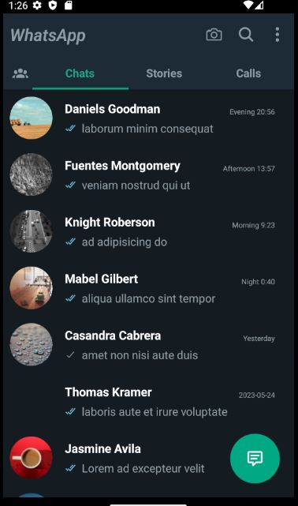
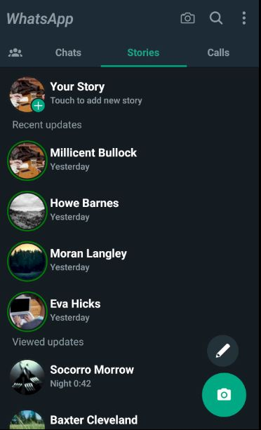
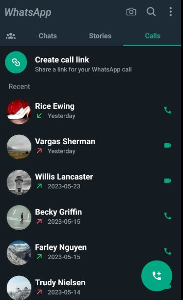
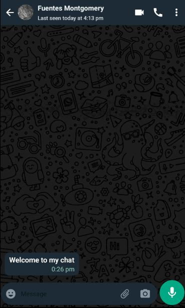
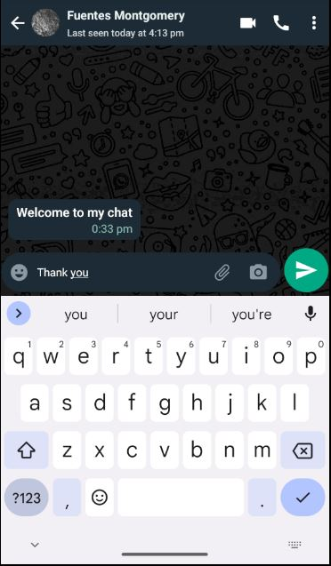
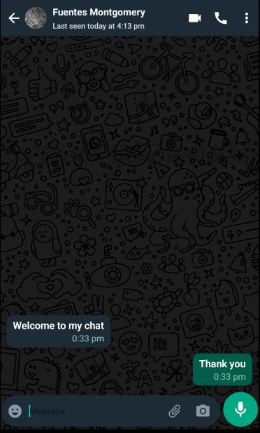

# WhatsApp Clone Application

This is a frontend-only WhatsApp clone app developed using React Native. It aims to replicate the user interface and some functionality of the popular messaging application WhatsApp.

## Features

- Chats
- Stories - Status
- Calls
- Chat - "when you press a message" : You can send a message but it doesn't store.

## Screenshots

1. 
1. 
1. 
1. 
1. 
1. 

## Initial Setup

1. Import Icon Packege

```json
/* package-local.json */
 "dependencies": {
        //...
        "@react-navigation/material-top-tabs": "^6.6.2",
        "@react-navigation/native": "^6.1.6",
        "@react-navigation/native-stack": "^6.9.12",
        "expo": "~48.0.15",
        "expo-status-bar": "~1.4.4",
        "react": "18.2.0",
        "react-native": "0.71.8",
        "react-native-pager-view": "^6.2.0",
        "react-native-safe-area-context": "^4.5.3",
        "react-native-screens": "^3.20.0",
        "react-native-tab-view": "^3.5.1",
        "react-native-vector-icons": "^9.2.0"
      },
```

Make sure to run npm install to install the package.

2. Run the application

```bash
npm run android
```

## Contributing

Contributions are welcome! If you find any bugs or want to add new features, feel free to open an issue or submit a pull request. Please make sure to follow the code style and include relevant tests.

## Contact

For any questions or inquiries, please contact ysn.unlgl@gmail.com.
